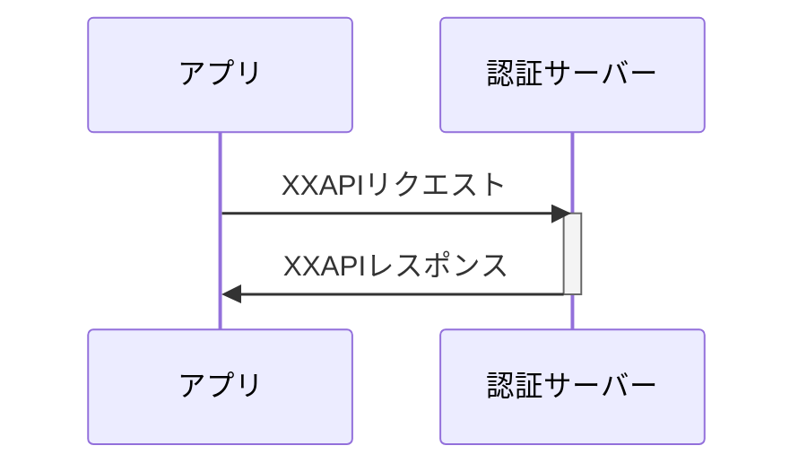
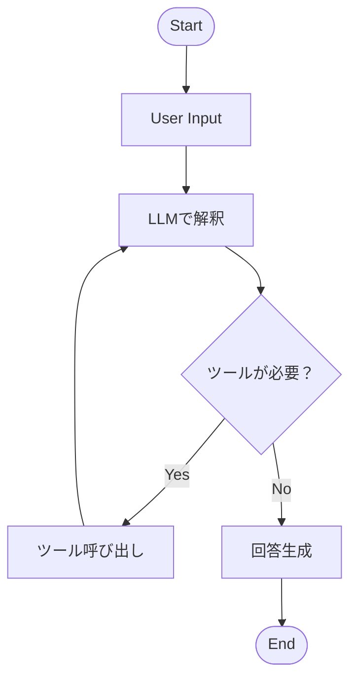

# API処理設計｛題名はAPI名とする｝

## 概要

｛このAPIで実現する業務目的を記載する｝

## シーケンス図

```mermaid
sequenceDiagram
    participant App as アプリ
    participant Server as 認証サーバー

    App->>Server: XXAPIリクエスト
    activate Server


    Server->>App: XXAPIレスポンス
    deactivate Server
```

## グラフ構成

```mermaid
flowchart TD
    Start([Start]) --> Input[User Input]
    Input --> LLM[LLMで解釈]
    LLM --> Decision{ツールが必要？}

    Decision -- Yes --> Tool[ツール呼び出し]
    Tool --> LLM

    Decision -- No --> Output[回答生成]
    Output --> End([End])
```

## マトリクス

### サンプル

| 条件 / ケース | 期待値 |
| ------------- | :----: |
| -             |   -    |

## 参考資料

- テーブル定義（リンク付き）
