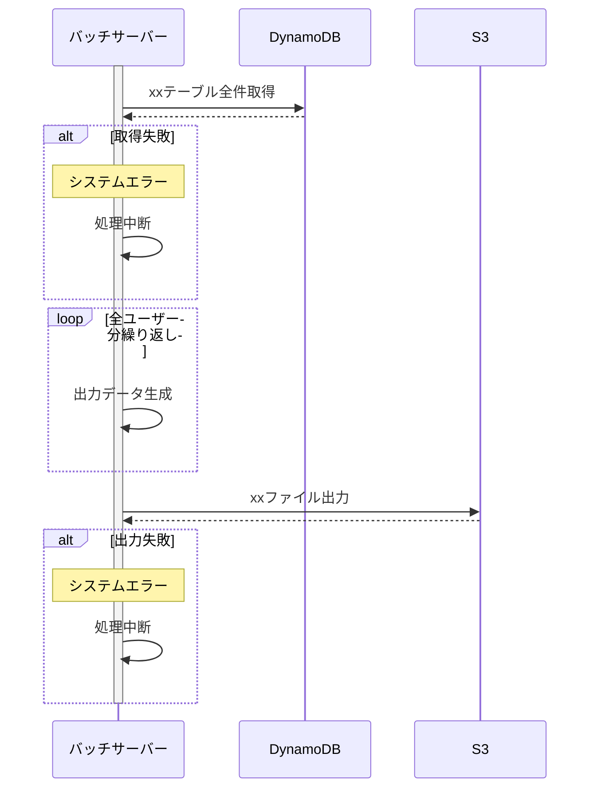

# バッチ処理設計｛題名はバッチ名とする｝

## 概要

｛このバッチで実現する業務目的を記載する｝

## 実行条件

- 前提条件：先行バッチ完了等
- 排他制御：同一バッチの多重起動禁止等

## 起動引数

| No  | パラメータ名 | 必須 | 文字種      | 桁数 | 説明       |
| --- | ------------ | ---- | ----------- | ---: | ---------- |
| 1   | mode         | ◯    | 1:xxx,2:yyy |    1 | zzz        |
| 2   | targetDate   | -    | YYYYMMDD    |    - | 処理対象日 |

## シーケンス図

## マトリクス

※処理が複雑でシーケンスに表しきれないものはマトリクスを記載する
| No | 処理名 | 概要 | エラー時動作 |
| --- | ---------- | -------- | ------------------ |
| 1 | ｛処理名｝ | ｛概要｝ | ｛エラー時の動作｝ |
| 2 | ｛処理名｝ | ｛概要｝ | ｛エラー時の動作｝ |
| 3 | ｛処理名｝ | ｛概要｝ | ｛エラー時の動作｝ |

## 参考資料

- 入力ファイル（ファイル定義のリンクをはる）
- 出力ファイル（ファイル定義のリンクをはる）
- テーブル（テーブル定義のリンクをはる）
